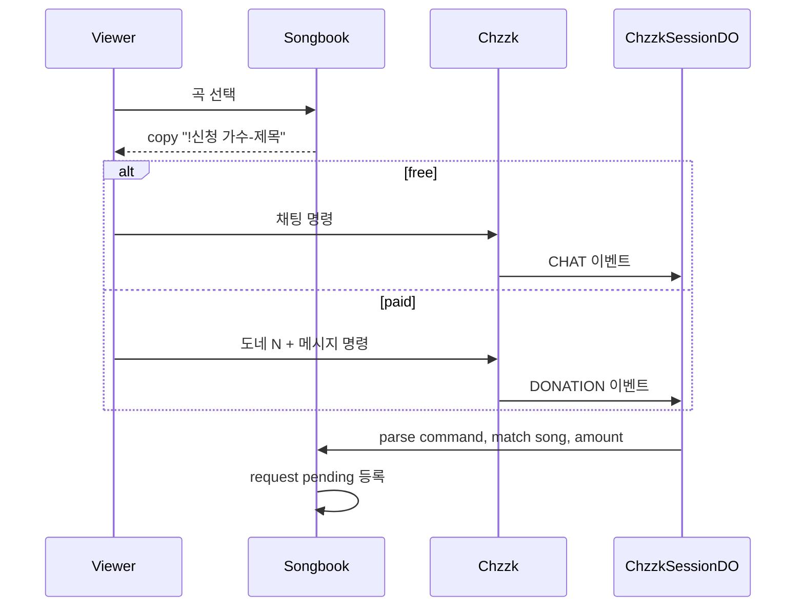

# 치지직 채팅·도네 × 신청곡 (설계)

구현 전 설계 메모입니다. 체크리스트는 [TODO.md](../TODO.md) §7을 보세요.

## 추천 방향

**치지직 공식 Open API + `!신청 가수-제목` 명령문 매칭.**

- [Session API](https://chzzk.gitbook.io/chzzk/chzzk-api/session)로 실시간 이벤트 수신 (후원 `DONATION`, 무료용 **채팅** 구독 — Scope·이벤트명은 연동 시 공식 문서에서 확인).
- 드롭스 Webhook은 게임 리워드용이므로 치즈 후원에 쓰지 않음.
- 비공식 중계(SSAPI 등)는 약관·운영 리스크로 본선에서 제외.
- Songbook은 결제·정산을 하지 않음. **이벤트 파싱·곡 DB 매칭·대기열 등록만** 담당.

### 시청자 흐름

1. 노래책에서 곡 선택 → **복붙용 명령문** 표시·복사  
   예: `!신청 윤하-사건의 지평선`  
   (형식: `{prefix} {artist}-{title}`, prefix 기본값 `!신청`)
2. 경로 분기  
   - **무료**: 치지직 **채팅**에 명령 붙여넣기  
   - **유료**: 치즈 **N개 이상** 후원, **메시지**에 동일 명령 붙여넣기
3. Songbook이 채팅/도네 텍스트에서 명령 파싱 → 채널 곡 DB 매칭 → `pending` 대기열 등록
4. 거절·무시: 형식 불일치, DB 미매칭(비활성 곡 포함), 금액 미달(유료), 중복 이벤트 ID

채널 설정 `request_mode`: `free` | `paid` | `both` (기본 제안: `both`).

- `free` / `both`: 웹 `POST /requests`는 **보조 경로**로 유지 (채팅 없이도 신청 가능).
- `paid`: 웹 즉시 신청은 막고, 복붙 안내 + 도네만 허용(또는 웹은 안내만).

### 명령문 + DB 매칭을 쓰는 이유

- 랜덤 짧은 코드(`A3F2`)·checkout 없이, 채팅만으로도 신청 가능 (타 방송 봇 UX와 유사).
- 복붙 문자열이 **가수·제목을 그대로 보여** 시청자·스트리머가 내용을 확인하기 쉬움.
- 닉네임만 매칭하면 동명이·타이밍 충돌이 많음.
- 곡명만 자유 입력하면 파싱이 깨지기 쉬워, **UI가 만든 정규 형식**을 복사하게 함.

### 파싱·매칭 규칙 (안)

- prefix: 채널 설정 (기본 `!신청`), 대소문자·앞뒤 공백 무시.
- 본문: 첫 `-`(하이픈)을 기준으로 `artist` | `title` 분리. 제목에 `-`가 있으면 **첫 구분자만** artist 쪽 경계로 쓰거나, UI가 복사할 때 artist/title에 하이픈이 있으면 대체 구분자(예: ` — `)를 쓰는 옵션을 둠.
- 정규화: trim, 연속 공백 축소, 유니코드 NFKC, 비교 시 대소문자 무시(영문).
- 매칭: 해당 채널 `songs` 중 `enabled=1` 이고 정규화한 `artist`·`title`이 일치하는 행.  
  - 0건 → 무시/거절 로그  
  - 2건 이상(동명곡) → 거절 또는 `external_id`/우선순위 규칙 (채널 옵션으로 완화 가능, 1차는 exact 1건만 수락)
- 유료: `payAmount >= request_price_krw` (원 단위; UI는 치즈 개수 표기). 미달 시 대기열 미등록.
- 멱등: 채팅 메시지 ID → `chat_message_ref`, 도네 ID → `donation_ref`. 동일 ref 재수신 시 no-op.

## 아키텍처

치지직 세션은 **장연결 Socket.IO**라서 요청-응답 Workers만으로는 부족함. 채널당 Durable Object(`ChzzkSessionDO`, 구칭 DonationSessionDO) 제안:

- 스트리머가 `/me` 또는 운영 화면에서 치지직 OAuth 연결 (refresh token 저장)
- DO가 세션 URL 발급 → Socket 연결 → **`DONATION` + 채팅(CHAT) 구독**
- 이벤트마다 명령 파서 → 곡 매칭 → (유료면) 금액 검증 → `requests` INSERT
- 끊김 시 alarm으로 재연결, Access/Refresh 토큰 백그라운드 갱신

단기 대안: Manager가 세션을 붙잡고 Songbook `POST .../chzzk/ingest`로 채팅·도네 페이로드 릴레이. 장기적으로는 DO가 단순함.

채팅 구독에 필요한 Scope·이벤트 스키마는 **연동 착수 시 공식 문서로 확정**한다. 설계 방향(무료=채팅 / 유료=도네)은 고정.

## 데이터 모델 (안)

채널 설정 (`settings` 또는 전용 키):

- `request_mode` — `free` | `paid` | `both`
- `request_price_krw` — 유료 최소 금액(원)
- `request_command_prefix` — 기본 `!신청`
- (선택) `request_command_separator` — 기본 `-`

치지직 링크: `channel_chzzk_links` 등 별도 테이블에 OAuth 토큰 보관.

`request_checkouts` 테이블은 **쓰지 않음** (짧은 코드 신청권 폐기).

기존 `requests` 확장:

- `pay_amount` (nullable) — 유료 후원 금액
- `donation_ref` (nullable, UNIQUE per channel) — 도네 멱등 키
- `chat_message_ref` (nullable, UNIQUE per channel) — 채팅 멱등 키

(선택) `ingest_events`:

- `channel_id`, `source` (`chat`|`donation`), `external_id`, `raw`, `status`, `created_at`
- 파서 실패·미매칭 디버깅용

무료 웹 신청: 지금처럼 바로 `pending` INSERT (`pay_amount`/`donation_ref`/`chat_message_ref` null).  
유료·채팅 경유: ingest 성공 시에만 INSERT.

## API·UI (스케치)

- 시청자 모달: 곡 확정 시 **명령문 미리보기 + 복사** / 유료면 치즈 금액·도네 안내. checkout 폴링 없음.
- 명령문 조합은 클라이언트(또는 얇은 helper API)에서 `artist`/`title`로 생성. 별도 checkout 리소스 없음.
- (검증용) `POST /api/c/:slug/chzzk/ingest` — Manager/수동 도구가 채팅·도네 페이로드를 넣을 때
- `paid` 모드면 기존 `POST /requests`는 403 또는 checkout 안내로 유도
- 운영: 가격·모드·prefix, 대기열 금액 뱃지, 치지직 연결 상태

## 도입 단계

1. 명령 파서 + 곡 매칭 + `ingest` 수동/호스트 확인으로 플로우 검증. 스키마(`pay_amount`, ref 컬럼, 설정 키).
2. 치지직 OAuth + DO **도네** 구독 → 유료 자동 매칭.
3. **채팅** 구독 → 무료 자동 매칭. `paid`/`both` 고도화·동명곡 옵션.

## 주의

- 치즈 결제·정산은 치지직이 담당. Songbook은 이벤트 매칭만 함.
- Access Token 약 1일 / Refresh 약 30일 → 백그라운드 refresh 필수.
- 개발자 센터 앱 등록, 후원(및 채팅) 조회 Scope, 채널(스트리머) 동의 필요.
- 제목·가수에 하이픈이 많은 곡은 복사 형식·파서를 채널 옵션으로 맞춰야 함.
