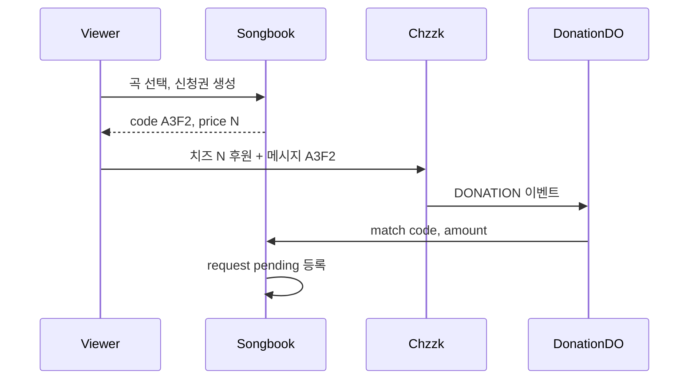

# 치지직 도네 × 유료 신청곡 (설계)

구현 전 설계 메모입니다. 체크리스트는 [TODO.md](../TODO.md) §7을 보세요.

## 추천 방향

**치지직 공식 Open API + 신청 코드 매칭.**

- [Session API](https://chzzk.gitbook.io/chzzk/chzzk-api/session)의 `DONATION` 구독으로 `payAmount`, `donatorNickname`, `donationText` 수신 (Scope: 후원 조회).
- 드롭스 Webhook은 게임 리워드용이므로 치즈 후원에 쓰지 않음.
- 비공식 중계(SSAPI 등)는 약관·운영 리스크로 본선에서 제외.

### 시청자 흐름

1. 노래책에서 곡 선택 → **신청권(checkout)** 생성 + 짧은 코드(예: `A3F2`)
2. “치즈 N개 후원, 메시지에 코드 입력” 안내
3. 치지직 후원 수신 → 코드·금액 검증 → `pending` 대기열 등록
4. 만료(예: 10분)·금액 미달·중복 처리는 거절/만료

채널 설정 `request_mode`: `free` | `paid` | `both` (기본 제안: `both`).

### 코드 매칭을 쓰는 이유

- 닉네임만 매칭하면 동명이·타이밍 충돌이 많음.
- 후원 메시지에 곡명을 쓰게 하면 파싱이 깨지기 쉬움.
- 코드 + 금액 검증 + 후원 ID 멱등이 명확함.

## 아키텍처

치지직 세션은 **장연결 Socket.IO**라서 요청-응답 Workers만으로는 부족함. 채널당 Durable Object(`DonationSessionDO`) 제안:

- 스트리머가 `/me` 또는 운영 화면에서 치지직 OAuth 연결 (refresh token 저장)
- DO가 세션 URL 발급 → Socket 연결 → `subscribe/donation`
- 이벤트마다 checkout 매칭
- 끊김 시 alarm으로 재연결

단기 대안: Manager가 세션을 붙잡고 Songbook `POST .../donations/ingest`로 릴레이. 장기적으로는 DO가 단순함.

## 데이터 모델 (안)

채널 설정:

- `request_mode`, `request_price_krw` (원 단위; UI는 치즈 개수로 표기)
- 치지직 링크는 `channel_chzzk_links` 등 별도 테이블에 토큰 보관

`request_checkouts` (신규):

- `code`, `song_id`, 스냅샷, `nickname`, `comment`
- `price_krw`, `status` (`awaiting_payment` | `fulfilled` | `expired` | `cancelled`)
- `expires_at`, `donation_id`, `pay_amount`, `donator_nickname`

기존 `requests` 확장:

- `pay_amount`, `donation_ref` (nullable)
- 무료는 지금처럼 바로 `pending`; 유료는 checkout 이행 시에만 INSERT

## API·UI (스케치)

- `POST /api/c/:slug/checkouts` → `{ code, priceKrw, expiresAt }`
- `paid` 모드면 기존 `POST /requests`는 막거나 checkout으로 유도
- 시청자 모달: 가격·코드·후원 안내 + checkout 상태 폴링
- 운영: 가격·모드, 대기열 금액 뱃지, 치지직 연결 상태

## 도입 단계

1. 스키마·가격 설정·checkout + 호스트 수동 “결제 확인”으로 플로우 검증
2. 치지직 OAuth + DO 후원 구독 → 자동 매칭
3. 유료 전용 모드·금액 우선순위 등

## 주의

- 치즈 결제·정산은 치지직이 담당. Songbook은 이벤트 매칭만 함.
- Access Token 약 1일 / Refresh 약 30일 → 백그라운드 refresh 필수.
- 개발자 센터 앱 등록, 후원 조회 Scope, 채널(스트리머) 동의 필요.
