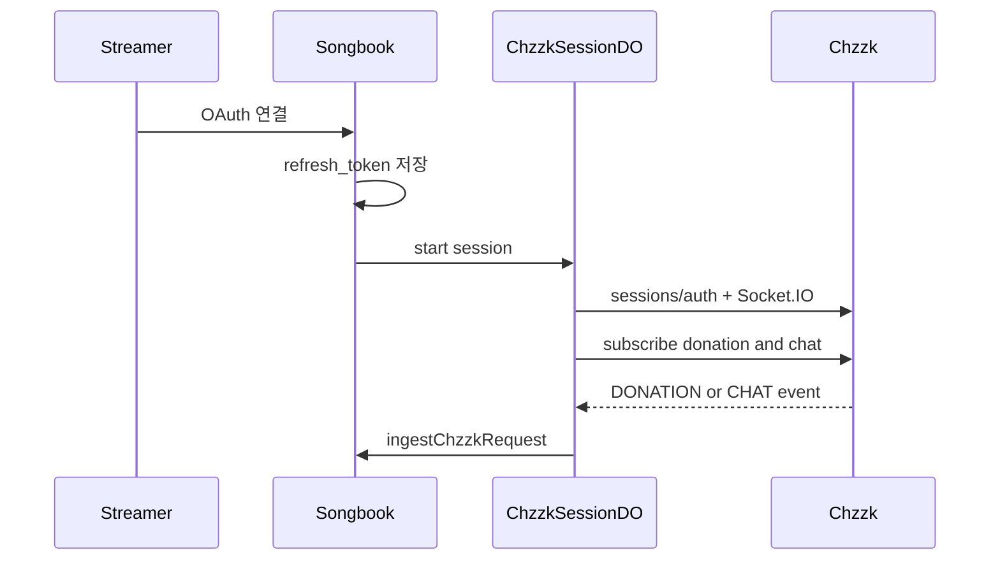

# 치지직 실시간 연동

설계 배경: [chzzk-paid-requests.md](./chzzk-paid-requests.md) · 체크리스트: [TODO.md](../TODO.md) §7

## 현재 상태

| 항목 | 상태 |
|------|------|
| 명령 파서 · `POST .../chzzk/ingest` · 시청자 복붙 모달 | 완료 |
| `channel_chzzk_links` · 치지직 OAuth(채널 연결) · 운영 UI | 코드 골격 완료 (시크릿·앱 등록 필요) |
| `ChzzkSessionDO` (Session Socket · 도네/채팅 → ingest) | 코드 골격 완료 (실연동 검증 필요) |
| 동명곡/하이픈 고도화 · ingest_events | 미착수 |

## 목표 아키텍처

장기 본선은 **Durable Object**. 검증용 `POST /api/c/:slug/chzzk/ingest`는 디버그용으로 유지.

## 도입 순서

### 이미 된 것 (Phase 1)

명령 파서, 곡 매칭, ingest, 스키마(`pay_amount`, refs), 시청자/운영 UI.

### 코드로 넣은 것 (Phase 2 골격)

1. Workers 시크릿: `CHZZK_CLIENT_ID`, `CHZZK_CLIENT_SECRET`
2. 테이블 `channel_chzzk_links`
3. OAuth: `/api/auth/chzzk/callback` + 운영 `GET .../admin/chzzk/connect`
4. `ChzzkSessionDO` — 세션 URL · Socket · 도네/채팅 구독 · `ingestChzzkRequest`
5. 운영 화면 연결/해제/세션 재시작

### 당신이 해야 할 일

1. **[치지직 개발자 센터](https://developers.chzzk.naver.com/) 앱 등록**  
   - Client ID / Secret  
   - Redirect URI  
     - 로컬: `http://localhost:5173/api/auth/chzzk/callback`  
     - 프로덕션: `https://<your-worker>.workers.dev/api/auth/chzzk/callback`  
   - Scope: **유저 정보 조회**, **채팅 메시지 조회**, **후원 조회** ([Session](https://chzzk.gitbook.io/chzzk/chzzk-api/session) · [User](https://chzzk.gitbook.io/chzzk/chzzk-api/user))

2. **시크릿 설정** (채팅에 Secret 붙이지 말 것)  
   - 로컬 `.dev.vars`  
   - 프로덕션: `wrangler secret put CHZZK_CLIENT_ID` / `CHZZK_CLIENT_SECRET`  
   - CI Environment secrets (쓰는 경우)

3. **DB 마이그레이션 (remote)**  
   - `npm run db:migrate:remote` 또는 `deploy:with-migrate`  
   - `0015` (요청 refs) + `0016` (치지직 링크) 포함

4. **E2E**  
   - 운영 → 치지직 연결(OAuth)  
   - 실후원 → 대기열  
   - 채팅 `!신청 가수-제목` → 대기열  
   - 끊김·토큰 만료 후 재연결 확인

5. **제품 규칙 (확정)**  
   - 연결 UI: 내 채널 (`/me`) — 한 번 연결 후 세션 유지  
   - 매핑: Songbook 채널당 치지직 링크 1개  
   - 신청 기본: 웹+채팅+후원, 명령 `!신청 가수-제목` (채널별 설정 UI 없음)

## API 요약

| Method | Path | 설명 |
|--------|------|------|
| GET | `/api/c/:slug/admin/chzzk` | 연결·세션 상태 |
| GET | `/api/c/:slug/admin/chzzk/connect` | OAuth 시작 (redirect) |
| DELETE | `/api/c/:slug/admin/chzzk` | 연결 해제 |
| POST | `/api/c/:slug/admin/chzzk/session` | 세션 시작/재시작 |
| POST | `/api/c/:slug/admin/chzzk/session/stop` | 세션 중지 |
| GET | `/api/auth/chzzk/callback` | OAuth 콜백 |
| POST | `/api/c/:slug/chzzk/ingest` | 수동 검증용 ingest |

## 주의

- 결제·정산은 치지직. Songbook은 이벤트 매칭만.
- Socket.IO는 Workers fetch만으로 불가 → DO 필수.
- Access ~1일 / Refresh ~30일(일회용) → DO alarm으로 refresh·재연결.
- Open API 도메인: `https://openapi.chzzk.naver.com`
- 인증 코드: `https://chzzk.naver.com/account-interlock`
